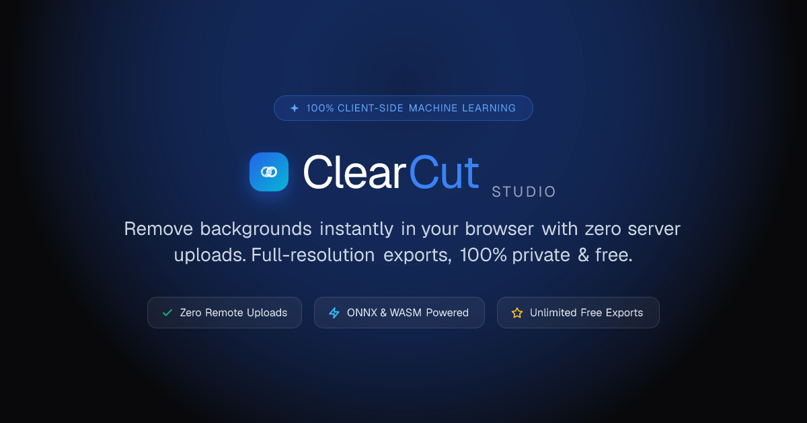
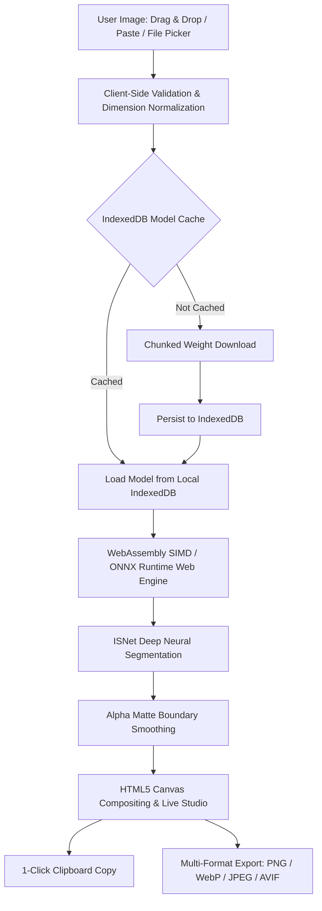

<div align="center">

  

  # ClearCut Studio

  ### ✂️ Instant In-Browser AI Background Remover • 100% Private

  <p align="center">
    <strong>Remove image backgrounds entirely inside your browser tab. Powered by WebAssembly (WASM) & ONNX neural networks.</strong><br />
    <em>Zero server uploads • Zero paywalls • Unlimited high-resolution exports.</em>
  </p>

  <p align="center">
    <a href="https://clear-cut.arifjahan.com/"><strong>🌐 Visit Live Website</strong></a> •
    <a href="#-quick-start">Quick Start</a> •
    <a href="#-features">Features</a> •
    <a href="#-export-formats">Export Formats</a> •
    <a href="#-architecture">Architecture</a> •
    <a href="#-shortcuts">Shortcuts</a> •
    <a href="#-tech-stack">Tech Stack</a>
  </p>

  <p align="center">
    <a href="https://clear-cut.arifjahan.com/"></a>
    <a href="https://nextjs.org/"></a>
    <a href="https://react.dev/"></a>
    <a href="https://tailwindcss.com/"></a>
    <a href="https://webassembly.org/"></a>
    <a href="https://onnxruntime.ai/"></a>
    
    <a href="LICENSE"></a>
  </p>

  <br />

  

</div>

<br />

---

## 💡 Why ClearCut Studio?

Traditional background removal services send your confidential photos, documents, and portraits over the internet to remote servers, often gating full-resolution downloads behind monthly subscriptions or watermarks.

**ClearCut Studio eliminates all servers from the equation.** The machine learning model runs directly on your device's hardware through WebAssembly SIMD and ONNX Runtime Web.

| Feature | ☁️ Cloud Removers (remove.bg, etc.) | ⚡ ClearCut Studio |
|:---|:---:|:---:|
| **Privacy & Security** | Photos uploaded to remote cloud servers | **🔒 100% Client-Side (0 bytes transmitted)** |
| **Pricing & Limits** | Credits, watermarks, paid monthly plans | **🎁 100% Free & Unlimited** |
| **Export Resolution** | Low-res preview free; HD requires payment | **💎 Full Resolution (up to 2048px)** |
| **Export Formats** | Usually PNG only | **📦 PNG, WebP, JPEG, AVIF with Live Size Preview** |
| **Offline Capability** | ❌ Fails without active internet | **📶 Works offline once cached in IndexedDB** |
| **Workflow Speed** | Waiting for cloud upload/download queue | **⚡ Instant local memory inference** |

---

## ✨ Features

### 📸 1. Preview Before Processing
- Drop or paste any photo to view an instant resolution and file size breakdown.
- Verify dimensions and image framing before triggering compute.
- Hit **Start Removal** or press <kbd>Enter</kbd> to execute.

### ⚡ 2. Real-Time Download Size Calculation
- Compare download file sizes in real time across **PNG**, **WebP**, **JPEG**, and **AVIF** before exporting.
- Dynamically recalculates as you adjust compression quality (Standard 80%, High 92%, Max 100%) or change solid studio backdrops.

### 🎚️ 3. Precision Edge Comparison
- Interactive split slider to inspect sub-pixel cut accuracy.
- Effortlessly inspect complex foregrounds: hair strands, fine animal fur, transparent jewelry, and glasses.

### 🎨 4. Studio Backdrop Customizer
- **Transparent**: Lossless alpha channel with a contrast checkerboard grid.
- **Studio Solids**: Curated clean studio palettes + custom hex color picker.
- **Vibrant Gradients**: Dual-tone smooth linear and radial gradient backdrops.
- **Custom Image Upload**: Drop your own backdrop image to composite in real time.

### 📋 5. 1-Click Clipboard & Export
- Copy transparent cutouts directly to your system clipboard (<kbd>Ctrl</kbd> + <kbd>C</kbd> equivalent) ready to paste straight into **Figma**, **Canva**, **Photoshop**, or **Slack**.
- Export in multiple formats with clean auto-naming and compression presets.

### 💾 6. IndexedDB Neural Model Caching
- Neural weights are retrieved once and cached locally in your browser's IndexedDB.
- All subsequent runs execute without re-downloading model weights, even when disconnected from the internet.

---

## 📦 Export Formats & Comparison

ClearCut provides purpose-built export formats tailored to your exact creative workflow:

| Format | Transparency | Ideal For | Typical Size Savings |
|:---:|:---:|:---|:---:|
| **PNG** | ✅ Yes (Alpha) | Figma, Canva, Photoshop, cutouts, graphic design | Baseline (Lossless) |
| **WebP** | ✅ Yes (Alpha) | High-speed websites, web apps, mobile apps | **~65% – 75% smaller** |
| **JPEG** | ❌ Studio Fill | E-commerce marketplaces (Amazon, Shopify), print | **~50% – 60% smaller** |
| **AVIF** | ✅ Yes (Alpha) | Modern high-performance web, next-gen delivery | **~75% – 85% smaller** |

---

## ⌨️ Shortcuts & Gestures

| Action | Shortcut / Input | Description |
|---|---|---|
| **Paste Image** | <kbd>Ctrl</kbd> + <kbd>V</kbd> or <kbd>⌘</kbd> + <kbd>V</kbd> | Paste any image or screenshot directly from your clipboard |
| **Start Removal** | <kbd>Enter</kbd> | Starts background removal when viewing an uploaded photo |
| **Drag & Drop** | Drag file over canvas | Accepts PNG, JPEG, WebP, AVIF, and BMP up to 5 MB |
| **Edge Slider** | Drag divider line | Compare original photo against the cutout |

---

## 🧠 Architecture & Pipeline



1. **Validation & Normalization**: The input image is decoded in-browser. Images exceeding 2048px are smoothly resized preserving exact aspect ratio to prevent memory spikes.
2. **Local Weight Cache**: Checks browser IndexedDB for stored ISNet weights.
3. **WASM Inference**: Evaluates tensor operations locally using WebAssembly SIMD multi-threading.
4. **Sub-Pixel Matting**: Generates a smooth alpha mask separating foreground from background.
5. **Compositing Studio**: Composites the alpha layer with user-selected colors, gradients, or custom backdrop images.

---

## 🛠️ Technology Stack

- **Framework**: [Next.js 16](https://nextjs.org/) (App Router, Turbopack)
- **UI Library**: [React 19](https://react.dev/)
- **Styling**: [Tailwind CSS v4](https://tailwindcss.com/)
- **Components**: [Base UI](https://base-ui.com/) & [shadcn/ui](https://ui.shadcn.com/)
- **In-Browser ML**: [@imgly/background-removal](https://github.com/imgly/background-removal-js) (ISNet ONNX Web, AGPL-3.0)
- **Animation**: [Framer Motion](https://www.framer.com/motion/)
- **Icons**: [Lucide React](https://lucide.dev/)
- **Typography**: [Plus Jakarta Sans](https://fonts.google.com/specimen/Plus+Jakarta+Sans) & [JetBrains Mono](https://fonts.google.com/specimen/JetBrains+Mono)
- **Theme**: [next-themes](https://github.com/pacocoursey/next-themes) (Dark/Light System Theme)

---

## 📁 Repository Structure

```
bg-remove/
├── app/
│   ├── globals.css              # Tailwind CSS v4 design system tokens
│   ├── icon.svg                 # SVG favicon & web app icon
│   ├── layout.tsx               # Root layout, fonts, SEO metadata & providers
│   └── page.tsx                 # Studio home page
├── components/
│   ├── home/
│   │   ├── FaqSection.tsx       # Interactive FAQ accordion
│   │   ├── FeaturesSection.tsx  # Feature cards & client-side highlights
│   │   ├── Hero.tsx             # Studio hero header
│   │   └── SpecsSection.tsx     # Technical resolution & privacy specs
│   ├── layout/
│   │   ├── Footer.tsx           # Clean footer with architecture links
│   │   ├── Header.tsx           # Navigation bar, privacy status & theme toggle
│   │   └── Logo.tsx             # Aperture gradient brand logo
│   ├── studio/
│   │   ├── BackgroundRemover.tsx    # Core studio orchestrator & state machine
│   │   ├── BackgroundReplacer.tsx   # Multi-format export & backdrop replacer
│   │   ├── ImageComparison.tsx      # Split before/after draggable slider
│   │   ├── ProcessingState.tsx      # Laser scanner progress animation
│   │   └── UploadZone.tsx           # Drag & drop upload area with demo samples
│   ├── ui/                          # Button, Card, Badge, Toast primitives
│   ├── ThemeProvider.tsx        # Dark/light theme context provider
│   └── ThemeToggle.tsx          # Smooth theme switcher
├── lib/
│   ├── constants.ts             # Export format configs, presets & FAQs
│   ├── image-utils.ts           # Canvas compositing & size calculation utilities
│   └── utils.ts                 # Class merging helper (`cn`)
├── public/
│   ├── favicon.svg              # Vector aperture favicon
│   ├── og-image.png             # Social OpenGraph card
│   └── samples/                 # Demo sample photos (portrait, product, pet)
├── next.config.ts               # COOP / COEP isolation headers configuration
└── package.json                 # Project dependencies & scripts
```

---

## 🚀 Quick Start

### Prerequisites
- **Node.js**: `18.18+` or `20+`
- **npm**, **pnpm**, or **yarn**

### 1. Clone & Install
```bash
git clone https://github.com/arifjahan88/clear-cut.git
cd clear-cut
npm install
```

### 2. Start Local Development Server
```bash
npm run dev
```

Visit [`http://localhost:3000`](http://localhost:3000) in your browser.

### 3. Build for Production
```bash
npm run build
npm run start
```

---

## 🌐 Browser Compatibility & WebAssembly SIMD

ClearCut Studio is optimized for modern web browsers equipped with WebAssembly SIMD and Web Workers:

| Browser | Minimum Version | WebAssembly Multi-Threading |
|---|:---:|:---:|
| **Google Chrome / Chromium** | 92+ | ✅ Full Acceleration |
| **Microsoft Edge** | 92+ | ✅ Full Acceleration |
| **Mozilla Firefox** | 89+ | ✅ Full Acceleration |
| **Apple Safari** | 15.2+ | ✅ Full Acceleration |

> [!NOTE]
> Multi-threaded tensor processing requires Cross-Origin Isolation headers (`Cross-Origin-Opener-Policy: same-origin` and `Cross-Origin-Embedder-Policy: credentialless`). These headers are configured by default in `next.config.ts`. If running in an environment without isolation, the engine automatically falls back to single-threaded WebAssembly.

---

## 🔒 Privacy Commitment

> [!IMPORTANT]
> **Zero Bytes Uploaded**: ClearCut Studio does not have a backend server for image processing. Every calculation is performed strictly in your browser tab. Your files never touch a remote server, database, or analytics bucket.

- **Confidential & Safe**: Safe for sensitive documents, personal IDs, and confidential creative assets.
- **Offline Capable**: Disconnect your Wi-Fi after the initial load — background removal continues to work seamlessly.

---

## 📄 License & AGPL-3.0 Open Source Compliance

ClearCut Studio is free and open-source software distributed under the **[GNU Affero General Public License v3.0 (AGPL-3.0)](LICENSE)**.

### 🌐 Open Source & Source Code Availability
In compliance with **Section 13 (Remote Network Interaction)** of the AGPL-3.0:
- The complete corresponding source code for this web application is freely and publicly accessible at [https://github.com/arifjahan88/clear-cut](https://github.com/arifjahan88/clear-cut).
- Anyone has the freedom to inspect, review, modify, fork, or self-host their own instance under the reciprocal terms of the AGPL-3.0.

### 🧠 Upstream ML Library & Commercial Deployments
In-browser neural segmentation is powered by [@imgly/background-removal](https://github.com/imgly/background-removal-js), created by [IMG.LY GmbH](https://img.ly).
- Under the AGPL-3.0 license, using `@imgly/background-removal` in public web applications requires keeping the entire application open source under AGPL-3.0 and providing source code access to network users.
- **Commercial Closed-Source Use**: If you wish to integrate this in-browser background removal engine into a proprietary, commercial, or closed-source application without open-sourcing your codebase under AGPL-3.0, you must obtain a commercial license directly from [IMG.LY GmbH](https://img.ly/company/contact) ([support@img.ly](mailto:support@img.ly)).

<div align="center">
  <sub>Built with ❤️ for privacy-first, client-side creative tools.</sub>
</div>
